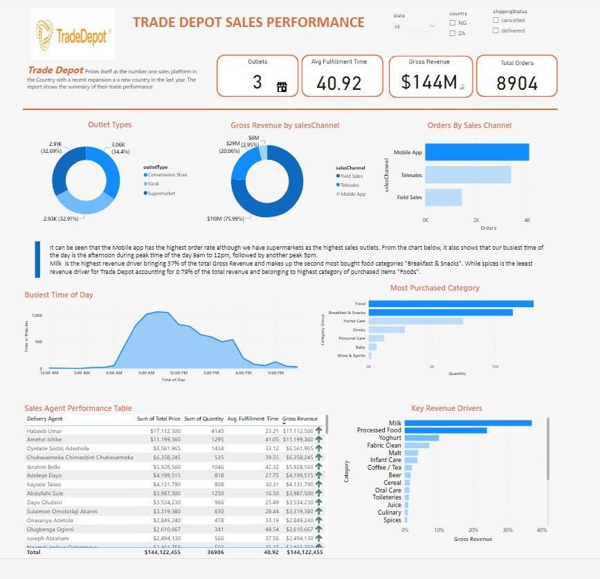

# Trade-Depot-Sales-Performance
Sales Performance Report for Trade Depot using Power BI

# 📊 TradeDepot Sales Performance Dashboard

This Power BI dashboard presents key insights into **TradeDepot’s sales performance**, visualizing order volume, fulfillment efficiency, sales channels, and agent performance based on data from three outlet types.

## 🚀 Summary KPIs

| Metric               | Value     |
|----------------------|-----------|
| Outlets              | 3         |
| Avg Fulfillment Time | 40.92 min |
| Gross Revenue        | $144M     |
| Total Orders         | 8,904     |

---

## 🛍️ Outlet Types Breakdown

- **Kiosk** has the highest order count: **3.06K orders (34.44%)**.
- **Convenience Store**: 2.91K orders (32.69%).
- **Supermarket**: 2.93K orders (32.91%).

## 🛒 Gross Revenue by Sales Channel

- **Mobile App** is the top-performing channel, generating **$110M (75.99%)** of revenue.
- Followed by:
  - **Field Sales**: $29M (20.06%)
  - **Telesales**: $4M (3.95%)

**Insight**: Mobile App drives the majority of revenue, despite supermarkets having the highest sales volume.

## 📦 Orders by Sales Channel

- **Mobile App** leads with the highest number of orders.
- **Telesales** and **Field Sales** follow with fewer transactions.

## 🕐 Busiest Time of Day

- Peak order activity occurs between **9 AM and 12 PM**.
- Secondary peak appears **after 3 PM**.

## 🧾 Most Purchased Product Categories

- **Foods** is the most purchased category (by quantity).
- Other popular categories:
  - **Breakfast & Snacks**
  - **Home Care**
  - **Drinks**

## 💰 Key Revenue Drivers

- **Milk** is the highest revenue driver, contributing **37%** of gross revenue.
- Other strong contributors:
  - **Processed Food**
  - **Yoghurt**
  - **Infant Care**

## 👥 Sales Agent Performance

| Agent Name                         | Gross Revenue   | Orders | Fulfillment Time (min) |
|-----------------------------------|------------------|--------|-------------------------|
| Habibeh Umar                      | $17,112,600.00   | 4,140  | 2.21                    |
| Amateh Ibitie                     | $11,190,965.00   | 1,245  | 4.95                    |
| Oyekale Sodiq Adeshola            | $6,511,196.00    | 1,128  | 3.04                    |
| Chukwuemeka Chimobi Chukwuwemeka | $6,125,264.50    | 1,035  | 3.46                    |
| Ibrahim Bello                     | $5,926,521.00    | 2,423  | 2.98                    |

> Total Gross Revenue from top agents: **$144,122,455.45**

## 📌 Notes

- Filters available in the dashboard include:
  - `State`, `Country` (NG or ZA), and `Shipping Status` (cancelled/delivered).
- The report highlights operational efficiency, channel performance, and key product insights to inform sales strategy.

🔗 **[View the full interactive dashboard here](https://app.powerbi.com/view?r=eyJrIjoiZmE2YmFiNzYtOWZjMS00MGE0LThhODQtNDM4Mzc4NDBhNmI5IiwidCI6ImRmODY3OWNkLWE4MGUtNDVkOC05OWFjLWM4M2VkN2ZmOTVhMCJ9)**

